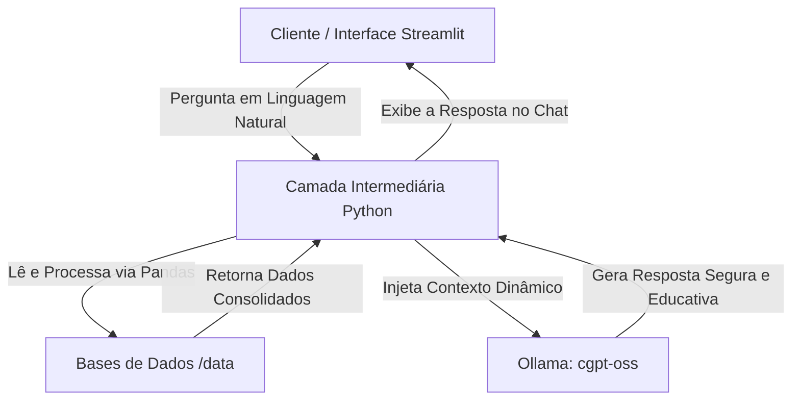

```markdown
# FinAI — Experiência Digital de Relacionamento Financeiro com IA Generativa

Este repositório contém a solução desenvolvida para o desafio de criar um assistente financeiro inteligente, integrando **Inteligência Artificial Generativa (Ollama)**, **Python (Pandas)** e **UX (Streamlit)**. 

O **FinAI** é um agente consultivo e educativo projetado para contextualizar a realidade financeira do cliente, responder FAQs de produtos de forma segura e realizar simulações demonstrativas precisas sem alucinações matemáticas.

---

## 🚀 Arquitetura da Solução

O agente foi desenhado para separar a inteligência comportamental (LLM) do processamento numérico (Python), garantindo 100% de precisão nos cálculos.



### Componentes Principais:

* **Interface (Streamlit):** Chatbot responsivo e interativo com persistência de contexto em memória de sessão (`st.session_state`).
* **Engine de Dados (Pandas):** Carrega e cruza os dados do cliente, isolando a LLM de erros de cálculo.
* **Orquestração de Prompts:** Injeção dinâmica de contexto de segurança, travas de *suitability* (perfil de risco) e tratamento de *edge cases* (perguntas fora de escopo).
* **LLM Local:** Integração nativa via API com o **Ollama** utilizando o modelo customizado `cgpt-oss`.

---

## 📁 Estrutura de Pastas

```text
dio-lab-bia-do-futuro/
├── run.py                 # Script de automação (instala dependências e roda o app)
├── Modelfile              # Arquivo de configuração e criação do modelo no Ollama
├── data/                  # Base de Conhecimento (Arquivos do laboratório)
│   ├── transacoes.csv
│   ├── historico_atendimento.csv
│   ├── perfil_investidor.json
│   └── produtos_financeiros.json
└── src/
    └── app.py             # Código-fonte principal do assistente FinAI

```

---

## 🛠️ Estratégias de Segurança e Anti-Alucinação

* **Matemática Isolada:** O saldo atualizado e o agrupamento de maiores gastos por categoria são calculados via código Python (Pandas) e injetados prontos no prompt, impedindo que a IA tente "adivinhar" contas.
* **Filtro de Suitability:** O catálogo de investimentos passa por uma máscara lógica em Python que oculta da IA os produtos incompatíveis com o perfil de risco do cliente logado.
* **Trava de Escopo e Dados Sensíveis:** Prompts de sistema rigorosos (*Few-Shot Prompting*) embutidos no ciclo de vida do modelo impedem que o agente responda sobre temas externos ou exponha credenciais.

---

## ⚡ Como Executar o Projeto

### 1. Configurando o Modelo customizado no Ollama

Para garantir que o modelo `cgpt-oss` use as diretrizes de comportamento do FinAI, crie um arquivo chamado `Modelfile` na raiz do projeto com o seu prompt de sistema e execute o comando abaixo para compilar o modelo localmente:

```bash
ollama create cgpt-oss -f ./Modelfile

```

### 2. Execução Automatizada da Aplicação

Basta executar o script de inicialização na raiz do projeto. Ele se encarregará de verificar e instalar todas as dependências necessárias (`streamlit`, `pandas`, `requests`) e abrirá o navegador automaticamente:

```bash
python run.py

```

---

## 📊 Métricas de Qualidade Avaliadas

O protótipo foi validado com sucesso nos seguintes cenários fundamentais:

* **Assertividade:** Retorno exato de despesas extraídas de logs estruturados.
* **Segurança:** Bloqueio de solicitações de alteração cadastral ou vazamento de dados de terceiros.
* **Coerência:** Recomendação estrita de investimentos baseada no perfil do usuário contido no JSON.

```

```
