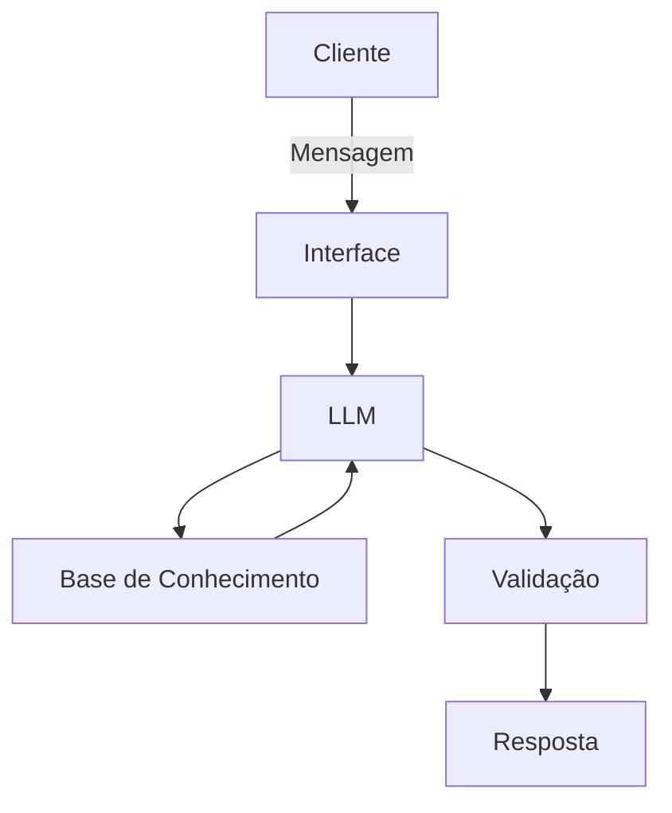

Aqui está a sua documentação preenchida com base na descrição do projeto, adotando uma postura profissional, clara e fundamentada em boas práticas de IA e UX:

# Documentação do Agente

## Caso de Uso

### Problema

> Qual problema financeiro seu agente resolve?

Muitos clientes de serviços financeiros enfrentam dificuldades para entender produtos, esclarecer dúvidas complexas (FAQs) ou realizar simulações financeiras básicas de forma rápida e autônoma. O suporte humano costuma ter filas, enquanto as automações tradicionais baseadas em árvores de decisão rígidas são frustrantes, impessoais e incapazes de compreender a linguagem natural ou o contexto do usuário.

### Solução

> Como o agente resolve esse problema de forma proativa?

O agente utiliza IA Generativa integrada ao ecossistema Python e princípios de UX para oferecer uma experiência de relacionamento financeiro fluida, inteligente e personalizada. Ele compreende a linguagem natural do cliente, mantém a persistência do contexto durante a conversa e resolve dúvidas de forma proativa, oferecendo explicações detalhadas de produtos e permitindo simulações de cálculos financeiros demonstrativos em tempo real, garantindo interações seguras e claras.

### Público-Alvo

> Quem vai usar esse agente?

Clientes de instituições financeiras (bancos digitais, fintechs ou cooperativas de crédito) que buscam atendimento ágil, educativo e personalizado para gerenciar suas dúvidas cotidianas, entender serviços e simular cenários financeiros sem a necessidade de esperar por um atendente humano.

---

## Persona e Tom de Voz

### Nome do Agente

FinAI (ou *Lumi*, *Vanguarda Assistente*, conforme sua preferência de marca)

### Personalidade

> Como o agente se comporta? (ex: consultivo, direto, educativo)

**Consultivo e Educativo.** O agente age como um mentor financeiro acessível. Ele não apenas responde o que foi perguntado, mas contextualiza a resposta de forma didática, empoderando o usuário a tomar decisões conscientes, sem ser intrusivo.

### Tom de Comunicação

> Formal, informal, técnico, acessível?

**Acessível, Empático e Transparente.** Evita o "juridiquês" ou jargões técnicos excessivos do mercado financeiro. Quando precisa usar termos técnicos, explica-os logo em seguida de maneira simples. Transmite segurança e solidez.

### Exemplos de Linguagem

* **Saudação:** "Olá! Seja bem-vindo ao seu espaço financeiro inteligente. Como posso te ajudar a planejar ou simular seus objetivos hoje?"
* **Confirmação:** "Compreendi perfeitamente. Estou processando os dados e fazendo os cálculos para você, só um momento."
* **Erro/Limitação:** "Desculpe, ainda não consigo realizar transações ou recomendar investimentos específicos. No entanto, posso te explicar como esse produto funciona ou simular um cenário para você. Vamos tentar?"

---

## Arquitetura

### Diagrama

### Componentes

| Componente | Descrição |
| --- | --- |
| **Interface** | Chatbot responsivo e interativo desenvolvido em **Streamlit** (Python). |
| **LLM** | Modelo de linguagem de última geração acessado via API para compreensão de contexto e geração de respostas. |
| **Base de Conhecimento** | Arquivos estruturados (**JSON/CSV**) e bases vetoriais contendo as FAQs de produtos, regras de negócio e dados demonstrativos. |
| **Validação** | Camada em Python usando expressões regulares ou prompts de sistema para filtrar respostas off-topic e travar cálculos matemáticos. |

---

## Segurança e Anti-Alucinação

### Estratégias Adotadas

* [X] **Restrição de Escopo:** O agente só responde com base nas regras de negócio e dados fornecidos na base de conhecimento.
* [X] **Transparência de Dados:** As respostas de simulação deixam claro que se tratam de demonstrações e informam as taxas/premissas utilizadas.
* [X] **Admissão de Falha:** Quando a pergunta foge do escopo ou a IA não encontra a informação, ela admite o desconhecimento de forma polida e redireciona para os canais de suporte humano.
* [X] **Bloqueio de Recomendação:** O agente não faz recomendações de investimento diretas ou personalizadas sem antes coletar ou validar o perfil de investidor (suitability) do cliente.

### Limitações Declaradas

> O que o agente NÃO faz?

* **Não realiza transações financeiras:** O agente não faz transferências, Pix, pagamentos de boletos ou contratações diretas de crédito.
* **Não altera dados cadastrais:** Não possui permissão para modificar senhas, e-mails ou informações sensíveis do usuário.
* **Não garante rentabilidade futura:** Toda simulação é estritamente demonstrativa e baseada em cenários hipotéticos.
* **Não opera fora do escopo financeiro:** Consultas sobre temas que não envolvam o ecossistema do produto ou finanças são bloqueadas pelo filtro de segurança.
